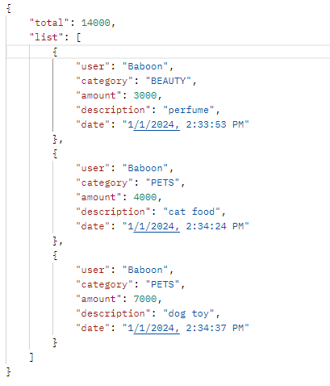
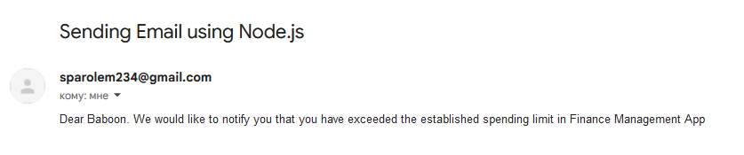

# Finance Management App

> Application that store information about your expenses

## Sections

- Authentication and authorization (register, login)
- Transactions (add, remove, get one, get list by time range, change category)
- Categories (create, delete)
- Monthly Limits (create, delete, update amount)

### Features

1. User are capable of adding, deleting, receiving list of transactions
2. User can create different categories of expenses or incomes
3. User is able to change category in existing transaction
4. User can get transaction list by time range (day, week, month)  
   
5. If the user exceeds the monthly limit, he will receive an information letter to his email.
   

## Tech

- NestJs
- Typescript
- Prisma ORM
- JWT
- Redis

## Quickstart

Clone this repository

```sh
git clone https://github.com/Jiraf400/nest-fin-management
```

> [WARNING]  
> You need to provide your own database connection url and jwt secret key in .env file

Install dependencies and run docker containers

```sh
npm i
docker-compose up -d
```
